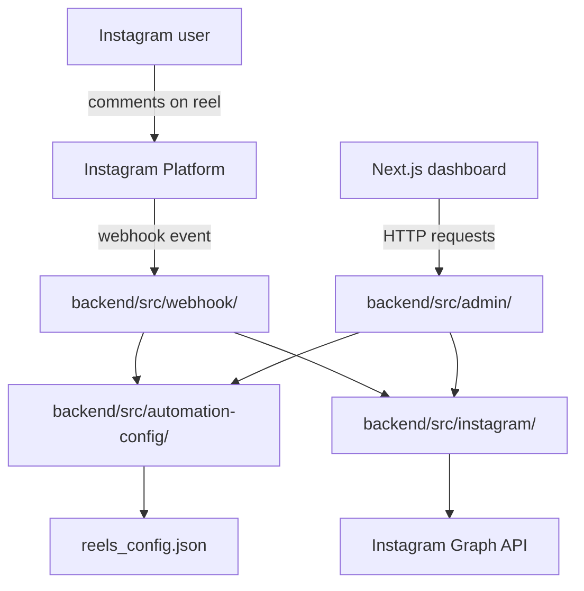
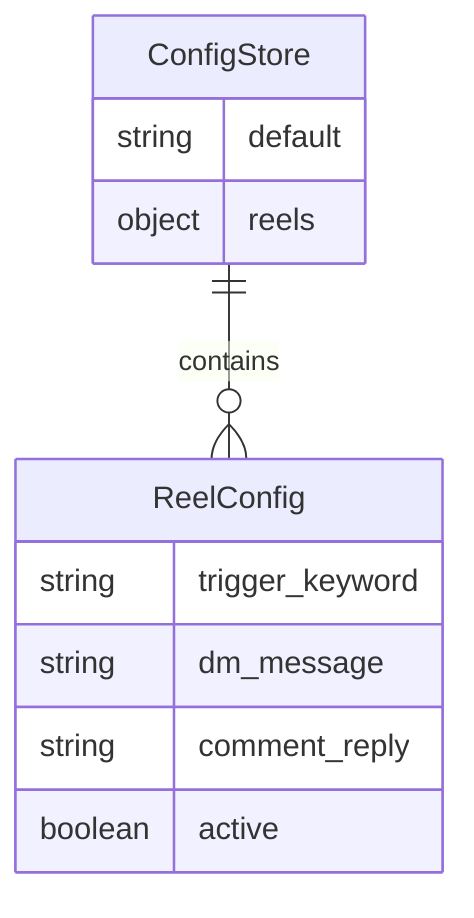

# Repository Guide: CommentDM Automation

## 1. Executive Summary

This repository is a small full-stack Instagram automation app. It combines a Node.js NestJS backend with a Next.js dashboard to automate comment-triggered direct messages and public comment replies.

The core idea is simple:

1. Instagram sends a webhook event when a user comments on a reel.
2. The backend checks the reel’s automation configuration.
3. If the comment contains the configured keyword and the reel is active, the backend sends a DM and/or replies publicly.
4. The frontend lets you view reels and edit these automation settings.

## 2. What This Project Does

This project helps automate Instagram engagement for business accounts.

Main capabilities:
- Detect comments that match a configured trigger keyword.
- Send a private DM to the commenter.
- Post a public reply to the comment.
- Manage per-reel automation settings from a dashboard.

## 3. Technology Stack

### Backend
- Node.js
- NestJS
- TypeScript
- Axios

### Frontend
- TypeScript
- Next.js 14
- React 18
- Axios
- Tailwind CSS

### Deployment / hosting
- Railway for the backend
- Vercel for the frontend

### Storage
- JSON file on disk, not a traditional database

## 4. Complete Repository Structure

### Root files
- [README.md](README.md): project overview and setup instructions
- [DEPLOYMENT_GUIDE.md](DEPLOYMENT_GUIDE.md): deployment walkthrough
- [RAILWAY_TEMPLATE.md](RAILWAY_TEMPLATE.md): Railway-specific hosting notes
- [railway.toml](railway.toml): Railway build and deploy config

### Backend
- [backend/src/main.ts](backend/src/main.ts): NestJS application entry point
- [backend/package.json](backend/package.json): Node.js dependencies
- [backend/railway.json](backend/railway.json): Railway deployment settings
- [backend/src/webhook/](backend/src/webhook/): Webhook processing module
- [backend/src/admin/](backend/src/admin/): Admin API module
- [backend/src/instagram/](backend/src/instagram/): Instagram API integration
- [backend/src/automation-config/](backend/src/automation-config/): Configuration persistence

### Frontend
- [frontend/package.json](frontend/package.json): Node dependencies and scripts
- [frontend/next.config.js](frontend/next.config.js): Next.js settings
- [frontend/tailwind.config.ts](frontend/tailwind.config.ts): Tailwind setup
- [frontend/tsconfig.json](frontend/tsconfig.json): TypeScript config
- [frontend/app/](frontend/app): app router pages and global styling
- [frontend/vercel.json](frontend/vercel.json): Vercel deployment config

## 5. Architecture

This is a lightweight layered app with separate backend and frontend services.

### Architectural style
- Simple request-driven web app
- Frontend and backend are separate deployments
- Backend acts as the integration layer between Instagram and the user dashboard

### Layers
- Frontend UI layer
- Backend API layer
- Service layer
- External Instagram API integration layer
- JSON-based persistence layer

### Dependency direction
- The frontend calls backend HTTP endpoints.
- The backend calls the Instagram Graph API.
- The backend reads and writes a JSON config file.

## 6. Application Startup

### Backend startup
The backend entry point is [backend/src/main.ts](backend/src/main.ts).

Startup flow:
1. NestJS app is created.
2. CORS middleware is added.
3. Controllers are registered via modules:
   - WebhookController in [backend/src/webhook/webhook.controller.ts](backend/src/webhook/webhook.controller.ts)
   - AdminController in [backend/src/admin/admin.controller.ts](backend/src/admin/admin.controller.ts)
4. Routes are exposed at `/`, `/health`, `/webhook`, and `/api/*`.
5. The app waits for incoming web requests.

### Frontend startup
The frontend is a Next.js app started via [frontend/package.json](frontend/package.json).

The main page is [frontend/app/page.tsx](frontend/app/page.tsx), which loads data from the backend when it mounts.

## 7. Core Execution Flows

### A. Dashboard loads
1. The user opens the Next.js dashboard.
2. [frontend/app/page.tsx](frontend/app/page.tsx) requests:
   - `GET /api/reels`
   - `GET /api/stats`
3. [backend/src/admin/admin.controller.ts](backend/src/admin/admin.controller.ts) fetches Instagram media items.
4. The backend also loads stored configuration from the JSON file.
5. The UI renders reels and stats.

### B. A user comments on a reel
1. Instagram sends a webhook POST request to `/webhook`.
2. [backend/src/webhook/webhook.controller.ts](backend/src/webhook/webhook.controller.ts) parses the event.
3. It checks whether the change is a comment event.
4. It looks up the reel configuration by media ID.
5. If the reel is active and the keyword matches, it sends a DM and/or a reply.

### C. A user edits a reel configuration
1. The frontend opens the edit modal.
2. The user submits the form.
3. [frontend/app/page.tsx](frontend/app/page.tsx) sends `PUT /api/reels/{media_id}`.
4. The backend saves the updated config into the JSON file.

## 8. Database Architecture

This project does not use a traditional database.

### Storage model
The configuration is stored in a JSON file managed by [backend/src/automation-config/automation-config.service.ts](backend/src/automation-config/automation-config.service.ts).

The file contains:
- a `reels` object keyed by Instagram media ID
- a `default` configuration object

Each reel config contains:
- `trigger_keyword`
- `dm_message`
- `comment_reply`
- `active`

### Why this matters
Because there is no database:
- there are no tables,
- no migrations,
- no SQL,
- no ORM.

## 9. API Architecture

### Important endpoints

| Method | Endpoint | Purpose |
|---|---|---|
| GET | `/` | Basic service status |
| GET | `/health` | Health check |
| GET | `/webhook` | Webhook verification |
| POST | `/webhook` | Receive Instagram comment events |
| GET | `/api/reels` | List reels with configuration |
| GET | `/api/reels/{media_id}` | Get one reel’s config |
| PUT | `/api/reels/{media_id}` | Update configuration |
| GET | `/api/stats` | Get configuration summary |
| POST | `/api/test/send-dm` | Test sending a DM |
| POST | `/api/test/reply-comment` | Test reply to a comment |

### Frontend-backend communication
The frontend uses Axios directly from [frontend/app/page.tsx](frontend/app/page.tsx) to call the backend endpoints.

## 10. Frontend Architecture

### Entry points
- [frontend/app/layout.tsx](frontend/app/layout.tsx): global layout and metadata
- [frontend/app/page.tsx](frontend/app/page.tsx): main dashboard

### UI behavior
- Fetches reels and stats on page load
- Displays reels in a visual grid
- Opens a modal to edit automation settings
- Sends updates back to the backend

### State management
The frontend uses React state via `useState` and `useEffect`.

### Styling
- Tailwind CSS utilities
- A custom `.glass` class from [frontend/app/globals.css](frontend/app/globals.css)

## 11. Business Logic

This is the heart of the app.

### Core rules
1. Each reel has a unique Instagram media ID.
2. Each reel can have custom automation settings.
3. If no specific config exists, the system falls back to the default config.
4. When a comment arrives:
   - the system checks whether the reel is active,
   - whether the trigger keyword appears in the comment text,
   - and if matched, it sends the configured DM and/or comment reply.

### Important behavior
- Keyword matching is case-insensitive because the code lowercases both values.
- The app skips comments that appear to be created by the bot itself.
- Empty DM or reply text is skipped.

## 12. Authentication & Security

### What exists
- Webhook verification token support via `VERIFY_TOKEN`
- The GET `/webhook` route checks that incoming `hub.verify_token` matches the configured token

### What is missing
- No login system
- No JWT/session authentication
- No role-based access control

### Security observations
- CORS is permissive
- The app relies on environment variables for sensitive values
- The webhook endpoint is publicly reachable and does not appear to use advanced signature verification

## 13. Error Handling

The app uses very basic error handling.

### Backend behavior
- The webhook handler prints detailed logs to stdout
- The admin routes catch exceptions and return HTTP 500 responses

### Frontend behavior
- API errors are logged to the browser console
- There is no rich error UI or retry mechanism

## 14. Configuration

### Backend environment variables
Defined in [backend/src/config/configuration.ts](backend/src/config/configuration.ts):
- `VERIFY_TOKEN`
- `INSTAGRAM_ACCESS_TOKEN`
- `IG_BUSINESS_ACCOUNT_ID`

### Frontend environment variable
- `NEXT_PUBLIC_API_URL`

### Configuration files
- [backend/.env.example](backend/.env.example)
- [frontend/.env.local.example](frontend/.env.local.example)
- [backend/railway.json](backend/railway.json)
- [frontend/vercel.json](frontend/vercel.json)

## 15. Testing

There are no automated tests in this repository.

What is present:
- No test directory
- No test runner configuration
- No test files

This means the project is currently validated mostly by manual testing and live integration.

## 16. Build & Deployment

### Backend
- Installed with `npm install`
- Started with `npm run start:prod`

### Frontend
- Installed with `npm install`
- Built with `npm run build`
- Served as a Next.js app

### Deployment flow
1. Backend deployed to Railway
2. Frontend deployed to Vercel
3. Instagram webhook points to the Railway backend
4. The dashboard points to the backend URL via `NEXT_PUBLIC_API_URL`

## 17. Dependency Graph

### Core modules
- [backend/src/main.ts](backend/src/main.ts)
- [backend/src/webhook/webhook.controller.ts](backend/src/webhook/webhook.controller.ts)
- [backend/src/admin/admin.controller.ts](backend/src/admin/admin.controller.ts)
- [backend/src/instagram/instagram.service.ts](backend/src/instagram/instagram.service.ts)
- [backend/src/automation-config/automation-config.service.ts](backend/src/automation-config/automation-config.service.ts)
- [frontend/app/page.tsx](frontend/app/page.tsx)

### Conceptual flow
- Frontend depends on backend API
- Backend depends on Instagram service and config manager
- Instagram service depends on Instagram Graph API
- Config manager depends on the filesystem

## 18. File-by-File Reference

### [backend/src/main.ts](backend/src/main.ts)
Purpose: NestJS entry point.

### [backend/src/config/configuration.ts](backend/src/config/configuration.ts)
Purpose: Loads environment variables used by the backend.

### [backend/src/webhook/webhook.controller.ts](backend/src/webhook/webhook.controller.ts)
Purpose: Handles incoming Instagram webhook events and triggers automation.

### [backend/src/admin/admin.controller.ts](backend/src/admin/admin.controller.ts)
Purpose: Exposes admin API endpoints for reels, stats, and manual testing.

### [backend/src/instagram/instagram.service.ts](backend/src/instagram/instagram.service.ts)
Purpose: Wraps Instagram Graph API calls for sending DMs, replies, and retrieving media.

### [backend/src/automation-config/automation-config.service.ts](backend/src/automation-config/automation-config.service.ts)
Purpose: Loads, saves, and updates reel configuration from JSON.

### [frontend/app/page.tsx](frontend/app/page.tsx)
Purpose: Main dashboard UI and API calls.

### [frontend/app/layout.tsx](frontend/app/layout.tsx)
Purpose: Global layout and metadata.

### [frontend/app/globals.css](frontend/app/globals.css)
Purpose: Global styles and the custom glass effect.

## 19. How to Modify the Project

### Add a new API endpoint
- Add a route in [backend/src/admin/admin.controller.ts](backend/src/admin/admin.controller.ts) or [backend/src/webhook/webhook.controller.ts](backend/src/webhook/webhook.controller.ts)
- Keep logic in appropriate services like `admin.service.ts`

### Add a new frontend page
- Create a new route under [frontend/app](frontend/app)
- Follow the pattern used by [frontend/app/page.tsx](frontend/app/page.tsx)

### Change business logic
- Main webhook behavior is in [backend/src/webhook/webhook.controller.ts](backend/src/webhook/webhook.controller.ts)
- Instagram API integration is in [backend/src/instagram/instagram.service.ts](backend/src/instagram/instagram.service.ts)

### Change persistence
- Configuration handling lives in [backend/src/automation-config/automation-config.service.ts](backend/src/automation-config/automation-config.service.ts)

## 20. Architectural Review

### Strengths
- Clear separation between frontend and backend
- Easy to understand for a small project
- Simple deployment model
- Minimal setup for a functional automation workflow

### Weaknesses
- No real database
- No tests
- Minimal error handling
- No authentication or authorization
- CORS is permissive

### Technical debt
The app is currently a practical prototype. It works well for a small automation use case, but it would need stronger structure if it grows.

### Suggested improvements
- Add tests
- Add proper authentication for admin routes
- Move to a real database
- Add structured logging and retry handling

## 21. Top 10 Things to Remember

1. This is an Instagram comment-to-DM automation system.
2. The backend is NestJS.
3. The frontend is Next.js.
4. Instagram comments trigger webhook processing.
5. Per-reel rules are stored in a JSON file.
6. The backend calls the Instagram Graph API.
7. The dashboard lets you edit automation rules.
8. The core business logic is keyword match -> send DM / reply.
9. There is no real authentication system today.
10. There are no automated tests.

## 22. Recommended Reading Order

1. [README.md](README.md)
2. [backend/src/main.ts](backend/src/main.ts)
3. [backend/src/webhook/webhook.controller.ts](backend/src/webhook/webhook.controller.ts)
4. [backend/src/admin/admin.controller.ts](backend/src/admin/admin.controller.ts)
5. [backend/src/instagram/instagram.service.ts](backend/src/instagram/instagram.service.ts)
6. [backend/src/automation-config/automation-config.service.ts](backend/src/automation-config/automation-config.service.ts)
7. [frontend/app/page.tsx](frontend/app/page.tsx)
8. [frontend/app/layout.tsx](frontend/app/layout.tsx)
9. [frontend/app/globals.css](frontend/app/globals.css)
